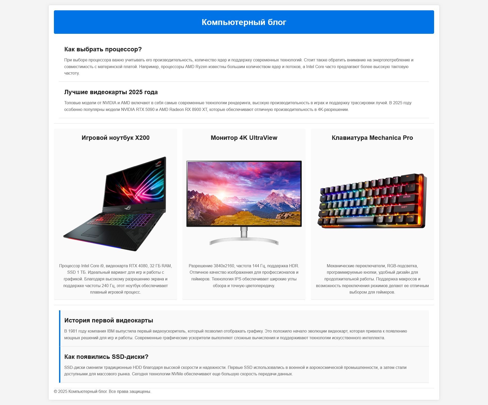

# Верстка страниц

## Срок сдачи работ

Последний коммит и пул реквест должен быть оформлен до 28.03.2025 23:59

## Цель:

Используя только CSS, оформить готовую HTML-страницу так, чтобы все элементы корректно располагались.

Условия:

- Вам дан файл index.html с готовой структурой страницы.
- Подключить CSS файл
- Написать CSS-правила, чтобы верстка была согласно макету

_Обратите, что тут используются все свойства, которые мы проходили, включая то, что было в блочной модели_

### Использованные цвета

`#f4f4f4`, `#333`, `#fff`, `#0073e6`, `#ddd`, `#222`, `#666`, `#fafafa`, `#f9f9f9`

### Использованные шрифты

`Arial`

_Перед началом работы не забудьте применить CSS reset_

```CSS
* {
    box-sizing: border-box;
    margin: 0;
    padding: 0;
}
```

## Готовый макет



## Как сдавать

1. Создайте форк репозитория в организации `21ISR` с названием `uidev-lab7-вашафамилия`
2. Используя ветку `wip` оформите необходимые файлы
3. Зафиксируйте изменения в вашем репозитории
4. Когда документ будет готов - создайте пул реквест из ветки `wip` (вашей) на ветку `main` (тоже вашу) и укажите меня ([ktkv419](https://github.com/ktkv419)) как reviewer

**Не мержите сами коммит**, это сделаю я после проверки задания
